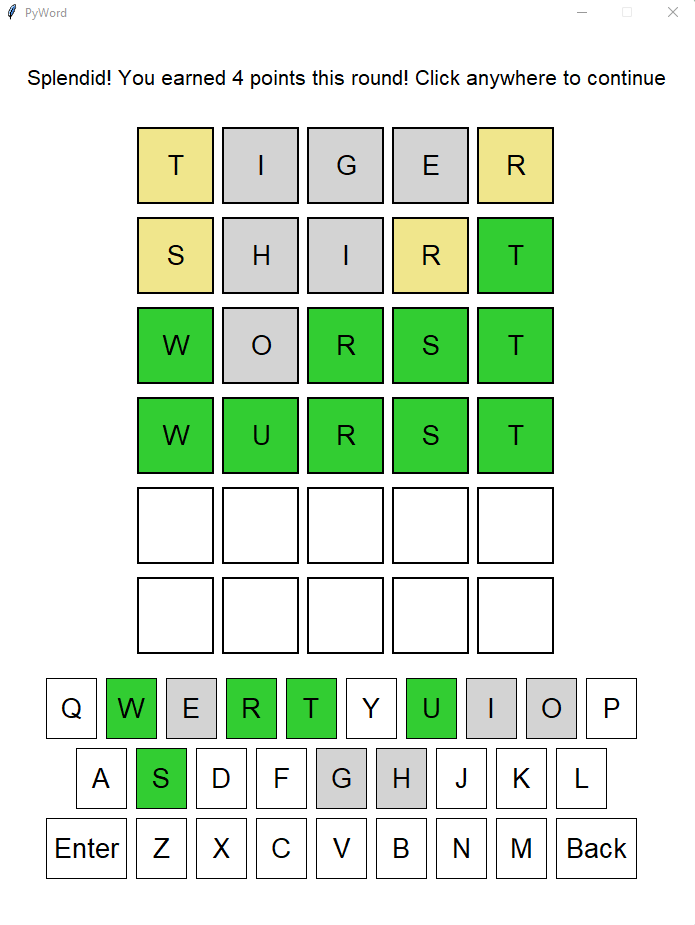

# PyWord

PyWord is a word game similar to Wordle or Jotto. Started as part of a Python course I took at Purdue, I expanded upon it after conclusion of the class

## Table of Contents
- [Background](#background)
- [Installing](#installing)
- [Using](#using)
- [Screenshots](#screenshots)
- [Sources](#sources)

## Background

PyWord was initially started as part of a certificate course I took at Purdue University in the Fall of 2022. It was the final project for the EBEC: Entry-Level Programming in Python course. 
The original version of this game was all text based in a terminal. Additionally, the word library was only a few hundred words. After completing the project, the material I had learned in the course inspired me to continue developing my Python & programming skills.

To further develop PyWord, I added a Graphical User Interface and updated the words.txt file to include over 5000 possible words.

## Installing

PyWord can be installed by downloading all of the files in the master branch.
PyWord depends on the graphics.py library. This can by installed through multiple methods. Using pip:
```
pip install graphics.py
```
For other methods, see the source for graphics.py in sources

## Using
Once installed, navigate in a terminal to the directory that contains pyword.py. Once in that directory, use the "python" keyword corresponding to your system, followed by pyword.py
For my system, I execute the command: 
```
$ python pyword.py
```
This will open a new window with the game running.
With a PyWord window open, it presents menu options. You can either begin a new game, view the hall of fame, or quit.
Playing the game is done by first starting a new game. You will be prompted to enter a name, and this will be used to store in the hall of fame.
Once presented with a 5x6 grid and a keyboard, this is the game. 
There are 3 rounds, and in each round you have 6 opportunities to guess a 5 letter word. As you enter your guesses, the letter boxes and keys change color indicating the correctness of that letter
Green: Indicates that letter is in the word and in that location
Yellow: Indicates that letter is in the word but not at that location
Gray: Indicates that letter is not in the word

As you complete each round, you earn points. Once a round ends, the next one immediately begins. Once all 3 rounds are completed, a screen showing the total of your points is displayed. It will also notify you if you got a score deserving of the hall of fame.

## Screenshots

<p align="center">

</p>

## Sources:

Knuth, Donald. The Stanford GraphBase: A Platform for Combinatorial Computing. New York: ACM Press, 1994. <http://www-cs-faculty.stanford.edu/~knuth/sgb.html>

Zelle, J. Mcsp.wartburg.edu. graphics.py, Simple object oriented graphics library. Retrieved January 4, 2023, from https://mcsp.wartburg.edu/zelle/python/graphics.py 
